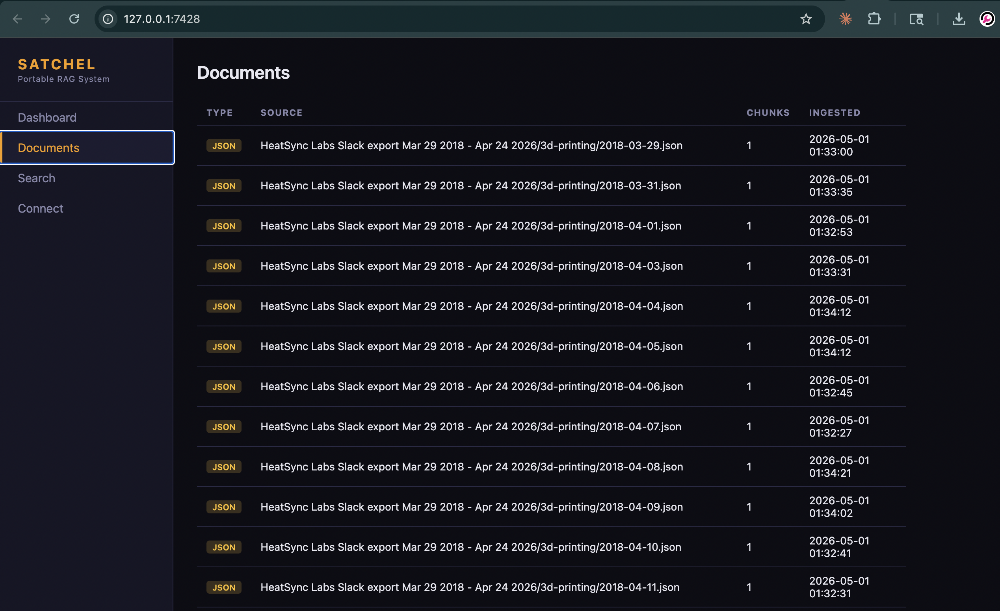
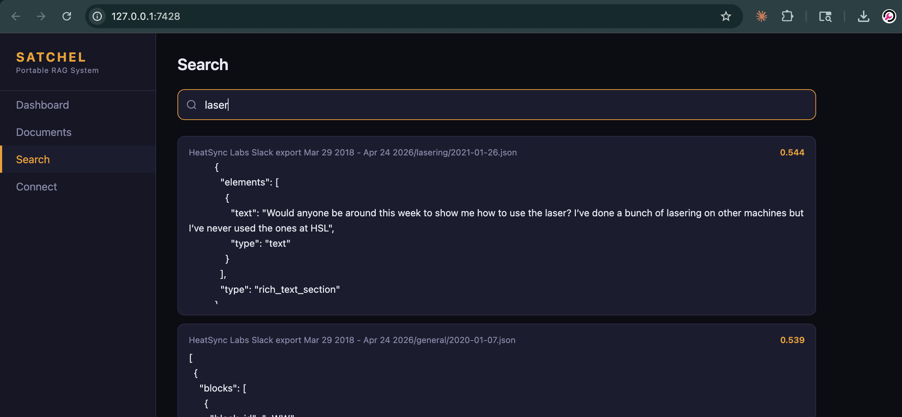
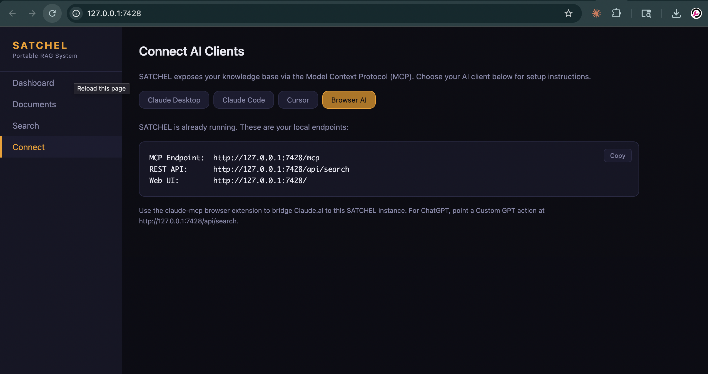

<picture>
  <source media="(prefers-color-scheme: dark)" srcset="assets/brand/logo-horizontal-dark.svg">
  
</picture>

**Self-contained Augmented Text Corpus for Host-free Embedded Lookup**

Portable RAG on a stick. Download one file, run it, and your entire knowledge base is available as context in Claude, ChatGPT, Cursor, or any MCP-compatible client — or chat with it directly in the bundled in-browser LLM. No cloud. No API keys. No installation. Everything runs locally.


| | |
|---|---|
|  |  |
|  | |

## Get Started

**1. Download** the zip for your platform from the [latest release](https://github.com/virgilvox/satchel/releases/latest). The embedding model is included. Nothing else to install.

**2. Extract and run:**

```bash
unzip satchel-macos-aarch64.zip
./satchel-macos-aarch64
```

This starts the web UI at [http://localhost:7428](http://localhost:7428) and opens it in your default browser. A default vault is created automatically on first run. On macOS, the first launch may be blocked by Gatekeeper — right-click the binary in Finder and choose "Open" once to allow it.

Pass `--no-browser` (or run from a non-interactive shell) to suppress the auto-open.

**3. Ingest your documents** — paste a path into the Ingest tab in the UI, or from the CLI:

```bash
./satchel ingest ~/Documents/notes/
```

**4. Connect your AI client** (see below).

That's it.

## Connect to Claude Desktop

Run `./satchel config` to get the config snippet, then paste it into Claude Desktop (Settings > Developer > Edit Config):

```json
{
  "mcpServers": {
    "satchel": {
      "command": "/full/path/to/satchel",
      "args": ["serve"]
    }
  }
}
```

Restart Claude. Your documents are now searchable in every conversation.

## Connect to Claude Code

```bash
claude mcp add satchel -- /full/path/to/satchel serve
```

## Connect to Cursor

Add to your Cursor MCP config:

```json
{
  "mcpServers": {
    "satchel": {
      "command": "/full/path/to/satchel",
      "args": ["serve"]
    }
  }
}
```

## Connect to claude.ai (web)

Claude.ai web does not natively support local MCP — its Connectors require an HTTPS public URL with OAuth. The simplest path: use Claude Desktop instead. If you must use claude.ai web, expose this server over HTTPS via a tunnel and add it as a Custom Connector:

```bash
# Cloudflare Tunnel (free, no signup):
cloudflared tunnel --url http://localhost:7428

# or ngrok:
ngrok http 7428
```

Then in claude.ai → Settings → Connectors → Add Custom Connector, point it at `https://<your-tunnel>/mcp`.

## Web UI

Running `./satchel` with no arguments starts the web interface at [http://localhost:7428](http://localhost:7428):

- **Dashboard** — vault stats, quick search.
- **Ask** — conversational entry to the vault. Phrase a question and a tool-call card calls `search_knowledge` against the vault, returning the top passages inline with source attribution. Pure retrieval — no external LLM, no network roundtrip.
- **Chat** — full in-browser LLM with tool calling against the local MCP server. Pick a small model (Qwen3, Llama 3.2 1B/3B, Phi-3.5 mini), it loads via WebGPU and caches in your browser, then chats over your vault using the same MCP tools (`search_knowledge`, `list_sources`, `get_document`, `list_tags`, `vault_stats`). Reasoning blocks render in a collapsible panel; tool calls render as teal-bordered cards inline with the assistant turn. Models that emit `<think>...</think>` are rendered with the reasoning isolated. *(Status: scaffolded; first model picker + WebLLM integration in progress — see [issues](https://github.com/virgilvox/satchel/issues) for the roadmap.)*
- **Search** — full hybrid retrieval with score ranking.
- **Documents** — browse ingested files.
- **Ingest** — paste a path or use the Browse modal to pick a folder; archives are auto-detected. Multiple folders can run concurrently and progress is tracked live (files seen, records added/skipped/failed, current file, elapsed time).
- **Manage** — delete documents by path prefix or file type, or wipe the vault.
- **Connect** — config snippets for every supported AI client.

The UI ships dark + light themes that follow the design system tokens. Toggle with the button in the topbar; choice persists in `localStorage` and falls back to `prefers-color-scheme` on first load.

## Supported File Types

**Single files:** Markdown, plain text, PDF, DOCX, HTML, CSV, TSV, JSON.

**Format-aware archives** (auto-detected and parsed structurally — no raw JSON blobs):

| Archive | Detection | What you get |
|---|---|---|
| Slack workspace export | `users.json` + `channels.json` at root | One chunk per message with `@username`, `#channel`, dates resolved; threads glued to their parent. |
| ChatGPT data export | `conversations.json` + `user.json` + `message_feedback.json` | One chunk per conversation, active branch only, system messages dropped. |
| Claude.ai data export | `conversations.json` + `users.json` + `projects.json` | One chunk per conversation; attachment-extracted text inlined. |
| Discord export | `{guild, channel, messages}` JSON (DiscordChatExporter) | One chunk per message; embeds attached as nested context. |
| WhatsApp chat export | `_chat.txt` or `WhatsApp Chat with *.txt` | One chunk per message; date format auto-detected (12h/24h, M/D vs D/M). |
| Email mbox | `.mbox` file or `From ` separator | One chunk per email with From/To/Subject/Date/Labels header. |

## Hybrid Search

Search runs **dense (cosine) + sparse (BM25)** retrieval in parallel and fuses results via Reciprocal Rank Fusion. This means proper nouns, usernames, project names, and exact phrases stay findable even when the embedding model has never seen them — the failure mode that breaks pure-vector RAG.

## Multiple Vaults

Keep separate knowledge bases for different contexts:

```bash
satchel vault create work
satchel vault create personal
satchel vault list
satchel vault use work
```

## Alternative Install Methods

### Cargo (builds from source, model not included)

```bash
cargo install satchel-rag
./scripts/download-model.sh
```

### Build from source with embedded model

```bash
git clone https://github.com/virgilvox/satchel.git
cd satchel
./scripts/download-model.sh
cargo build --release --features embed-model
```

## How It Works

SATCHEL generates 384-dimensional vector embeddings using [BAAI/bge-small-en-v1.5](https://huggingface.co/BAAI/bge-small-en-v1.5) (33M params, MTEB ~62), running locally via [candle](https://github.com/huggingface/candle) (pure Rust, zero C dependencies). The older [all-MiniLM-L6-v2](https://huggingface.co/sentence-transformers/all-MiniLM-L6-v2) model is still recognized for backward compatibility — pass `legacy` to `scripts/download-model.sh` to fetch it. Chunks and embeddings are stored in SQLite alongside an FTS5 keyword index. When your AI client asks a question, SATCHEL runs both retrievers in parallel and fuses ranks via RRF, then returns the top chunks as context.

For structured archives (Slack, ChatGPT, etc.), each logical message/conversation becomes one chunk with a normalized header line — names and dates show up verbatim in BM25 instead of being buried inside opaque JSON.

No data leaves your machine. No internet needed after download.

## MCP Tools

When connected, your AI client can use these tools:

| Tool | What it does |
|------|-------------|
| `search_knowledge` | Semantic search across all documents |
| `list_sources` | List ingested documents with metadata |
| `get_document` | Retrieve the full text of a document |
| `list_tags` | List tags and categories |
| `vault_stats` | Storage stats, document counts, model info |

## Managing Your Data

```bash
satchel delete <path>                       # exact source path
satchel delete --prefix "HeatSync Slack"    # everything under that prefix
satchel delete --type json                  # all .json documents
satchel delete --prefix X --dry-run         # preview without deleting
satchel clear                               # wipe entire active vault
```

The Manage tab in the web UI exposes the same operations with confirmation dialogs.

Delete is intentionally **not** exposed via MCP — your AI client should not be able to remove your data.

## REST API

Available when running with `--transport http` or with no arguments:

```
GET    /api/status              Server status and vault stats
GET    /api/sources             List ingested documents
DELETE /api/sources             Delete by {path|prefix|file_type, dry_run?}
POST   /api/search              Hybrid search  {"query": "...", "top_k": 5}
GET    /api/document?source=... Retrieve full document text
GET    /api/tags                List all tags
GET    /api/browse?path=...     Server-side directory listing
POST   /api/ingest              Queue an ingest job  {"path": "..."} → {"job_id"}
GET    /api/jobs                List recent ingest jobs (newest first)
GET    /api/jobs/:id            One job's full state and live counters
POST   /api/clear               Wipe vault (requires {"confirm": true})
POST   /mcp                     MCP Streamable HTTP endpoint
```

All endpoints return JSON. CORS is enabled.

## Contributing

See [CONTRIBUTING.md](CONTRIBUTING.md).

## License

[AGPL-3.0-only](LICENSE). For commercial licensing, visit [hack.build](https://hack.build).
