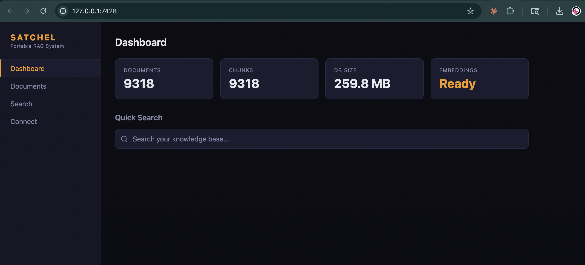
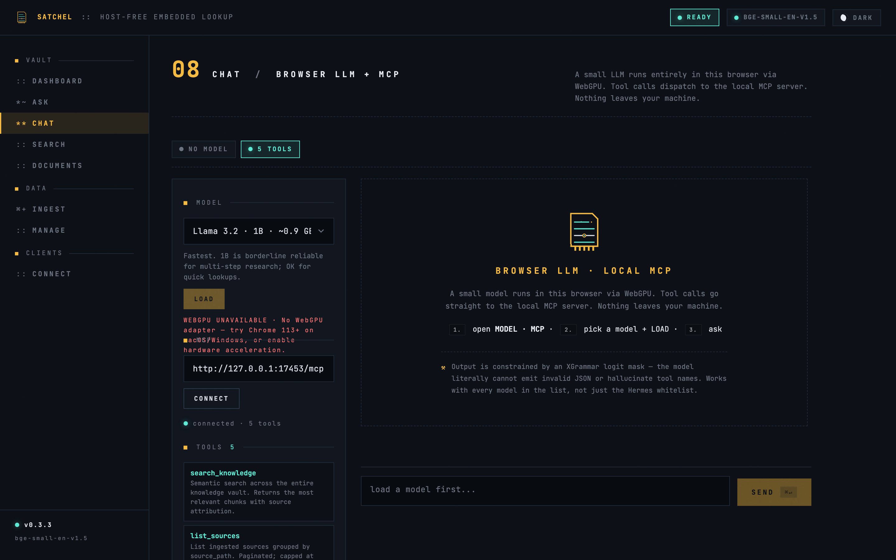
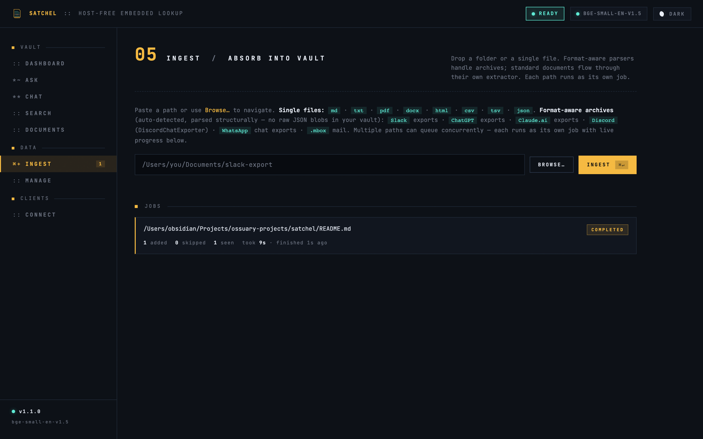
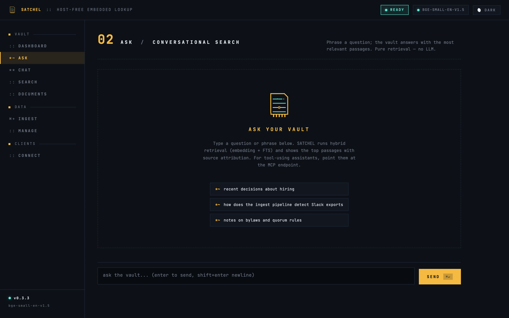
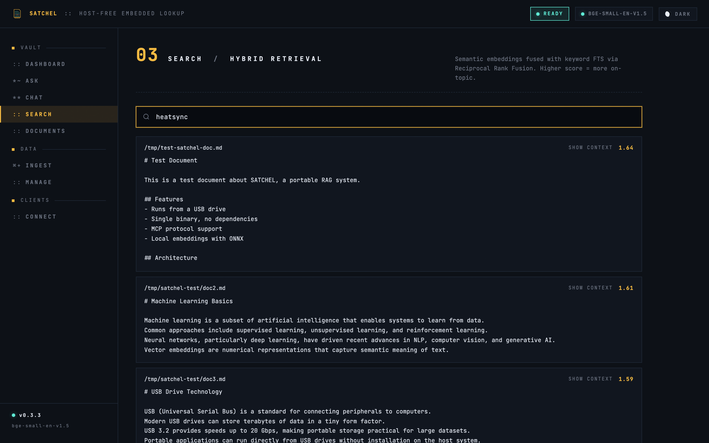
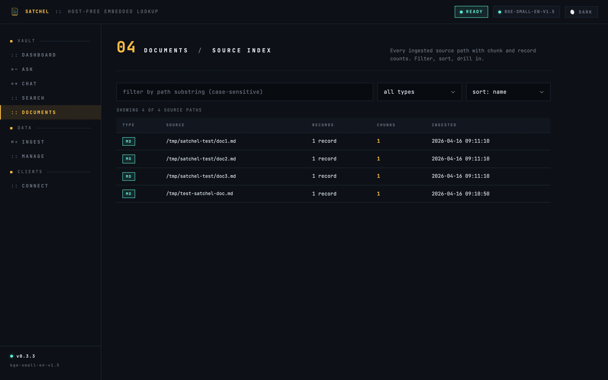
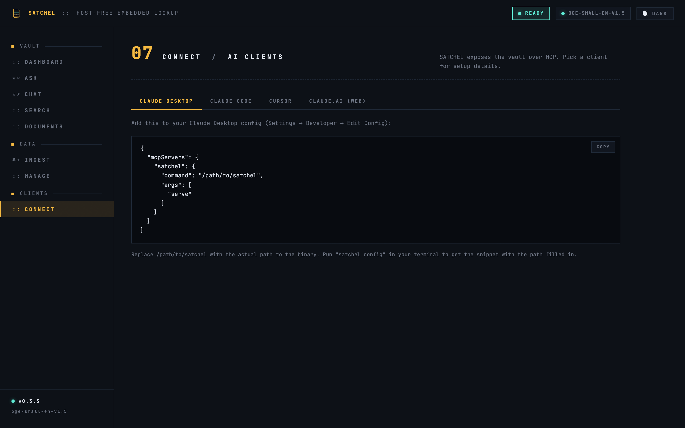

<picture>
  <source media="(prefers-color-scheme: dark)" srcset="assets/brand/logo-horizontal-dark.svg">
  
</picture>

**Self-contained Augmented Text Corpus for Host-free Embedded Lookup**

Portable RAG on a stick. Download one file, run it, and your entire knowledge base is available as context in Claude, ChatGPT, Cursor, or any MCP-compatible client — or chat with it directly in the bundled in-browser LLM. No cloud. No API keys. No installation. Everything runs locally.


*Dashboard — at-a-glance health for your portable knowledge corpus: doc and chunk counts, on-disk footprint, embedding-model state, and a quick-search box hot-wired to hybrid retrieval.*


*Chat — a small LLM runs entirely in your browser via WebGPU. Output is constrained to a per-tool JSON schema by an XGrammar logit mask, so the model literally cannot hallucinate tool names or emit invalid JSON. Tool calls dispatch to the local MCP server inline. Nothing leaves your machine.*


*Ingest — drop a folder or a single file. Single-file extractors handle Markdown, plain text, PDF, DOCX, HTML, CSV, TSV, and JSON; format-aware parsers detect Slack / ChatGPT / Claude.ai / Discord / WhatsApp / mbox archives and ingest with structural awareness (one chunk per message/conversation, sender + date resolved into the chunk text — no raw JSON in your vault). Multiple paths run concurrently with live counters.*

<table>
<tr>
<td width="50%">


*Ask — conversational entry to the vault. Pure retrieval, no LLM: phrase a question, the vault returns the top passages with source attribution and RRF scores.*

</td>
<td width="50%">


*Search — full hybrid retrieval. Dense embeddings fused with keyword FTS via Reciprocal Rank Fusion so proper nouns, usernames, and exact phrases stay findable even when the embedding has never seen them.*

</td>
</tr>
<tr>
<td width="50%">


*Documents — every ingested source path with chunk and record counts. Filter by substring, sort by name / date / chunks / records, drill in for context.*

</td>
<td width="50%">


*Connect — MCP config snippets for Claude Desktop, Claude Code, Cursor, and claude.ai (web). One click to copy.*

</td>
</tr>
</table>

## Get Started

**1. Download** the zip for your platform from the [latest release](https://github.com/virgilvox/satchel/releases/latest). The embedding model is bundled in. Nothing else to install.

**2. Extract and run.** The platform handles the icon for you.

### macOS

The zip extracts to `Satchel.app` — a real macOS bundle with the SATCHEL icon. Drag it to `/Applications` (or anywhere), then double-click. The first launch may be blocked by Gatekeeper — right-click the app in Finder and choose **Open** once to allow it. The web UI opens automatically at [http://localhost:7428](http://localhost:7428).

Terminal users can call the binary directly out of the bundle:

```bash
Satchel.app/Contents/MacOS/satchel ingest ~/Documents/notes/
Satchel.app/Contents/MacOS/satchel config
```

…or symlink it onto your `$PATH` once: `ln -s "$PWD/Satchel.app/Contents/MacOS/satchel" /usr/local/bin/satchel`.

> **macOS error `-47` ("can't be opened")** means a previous SATCHEL is still running and holding the binary — Finder refuses to launch a second copy that would overwrite it. v2.1.3+ bundles `LSMultipleInstancesProhibited` so re-clicking the icon focuses the running instance instead of failing. On older releases: `pkill -f satchel` then try again. If that doesn't clear it: `lsof -i :7428` to confirm nothing's still bound, then re-extract the zip and `xattr -dr com.apple.quarantine /Applications/Satchel.app` before opening.

### Windows

Double-click the .zip to extract, then run `satchel-windows-x86_64.exe`. The SATCHEL mark is embedded in the .exe via a Windows resource — Explorer / Alt-Tab / Task Manager all show it without extra files.

### Linux

The zip contains the binary plus `satchel.desktop` and `satchel.png` (ELF binaries can't host an icon resource — Linux uses the `.desktop` entry instead). Either run the binary directly:

```bash
unzip satchel-linux-x86_64.zip
chmod +x satchel-linux-x86_64
./satchel-linux-x86_64
```

…or install the desktop entry so SATCHEL shows up in your application launcher with the icon:

```bash
install -Dm755 satchel-linux-x86_64 ~/.local/bin/satchel
install -Dm644 satchel.png ~/.local/share/icons/hicolor/256x256/apps/satchel.png
install -Dm644 satchel.desktop ~/.local/share/applications/satchel.desktop
update-desktop-database ~/.local/share/applications 2>/dev/null || true
```

A default vault is created automatically on first run. Pass `--no-browser` (or run from a non-interactive shell) to suppress the auto-open.

**3. Ingest your documents** — paste a path into the Ingest tab in the UI, or from the CLI:

```bash
./satchel ingest ~/Documents/notes/
```

**4. Connect your AI client** (see below).

That's it.

## Connect to Claude Desktop

Run `./satchel config` to get the config snippet, then paste it into Claude Desktop (Settings > Developer > Edit Config):

```json
{
  "mcpServers": {
    "satchel": {
      "command": "/full/path/to/satchel",
      "args": ["serve"]
    }
  }
}
```

Restart Claude. Your documents are now searchable in every conversation.

## Connect to Claude Code

```bash
claude mcp add satchel -- /full/path/to/satchel serve
```

## Connect to Cursor

Add to your Cursor MCP config:

```json
{
  "mcpServers": {
    "satchel": {
      "command": "/full/path/to/satchel",
      "args": ["serve"]
    }
  }
}
```

## Connect to claude.ai (web)

Claude.ai web does not natively support local MCP — its Connectors require an HTTPS public URL with OAuth. The simplest path: use Claude Desktop instead. If you must use claude.ai web, expose this server over HTTPS via a tunnel and add it as a Custom Connector:

```bash
# Cloudflare Tunnel (free, no signup):
cloudflared tunnel --url http://localhost:7428

# or ngrok:
ngrok http 7428
```

Then in claude.ai → Settings → Connectors → Add Custom Connector, point it at `https://<your-tunnel>/mcp`.

## Web UI

Running `./satchel` with no arguments starts the web interface at [http://localhost:7428](http://localhost:7428):

A **SCOPE** chip in the top bar picks the active collection; every scoped view follows it (`ALL` means whole vault).

- **Dashboard** — vault stats, quick search, embedding-model status.
- **Ask** — conversational entry to the vault. Phrase a question; a tool-call card runs `search_knowledge` and returns the top passages with source attribution. Pure retrieval, no LLM, no network roundtrip. Follows the top-bar scope.
- **Chat** — picker spans two backends. **Local, WebLLM** runs a small model (Llama 3.2 1B/3B, Hermes 3, Qwen 2.5, Phi 3.5, Gemma 2, DeepSeek R1) entirely in your browser via WebGPU; output is locked to a per-tool JSON schema by an XGrammar logit mask. **Anthropic API** (Claude Opus 4.7 / Sonnet 4.6 / Haiku 4.5) streams through a server-side proxy with your saved API key, see *Settings → Anthropic API*. Tool calls go to the same MCPs either way. Reasoning blocks emitted as `<think>…</think>` render in a collapsible panel; tool calls render compact (collapsed by default) and expand on click. `search_knowledge` calls are auto-scoped by the top-bar chip. **Smart Mode** (v2.9.0+; on by default; toggle in Settings) makes long multi-turn chats reliable on small local LLMs by truncating verbose tool results, detecting when the model is looping the same call and nudging it to finalize, using a compact system prompt on WebLLM, and (v2.9.1+) auto-compacting the oldest tool exchanges when context use crosses 65%.
- **Search** — full hybrid retrieval with score ranking. Scoped by the top-bar chip.
- **Documents** — browse ingested files. Group sources into **collections** (named subsets like "Work", "Research", "Personal"); the tab strip is both a scope picker and the create/delete management surface. Multi-select rows and bulk move into a collection.
- **Ingest** — paste a path or use the Browse modal to pick a folder; archives are auto-detected. A destination block above the path input picks the target collection (follow the top-bar scope, no collection, pin to a specific one, or type a new name to create). Multiple folders run concurrently with live progress.
- **Manage** — delete documents by path prefix or file type, or wipe the vault.
- **Connect** — leads with the live local MCP URL, the `satchel.local` URL (when mDNS is on), and the LAN-IP URL, each with a one-click COPY. Per-client setup snippets for Claude Desktop, Claude Code, Cursor, and claude.ai web have the binary path auto-filled. A tunnel panel at the bottom publishes a public URL via bundled `cloudflared`.

Settings (gear icon in the chat strip) carries:
- generation knobs (temperature, max_tokens, max_rounds), agent backstops (min_tool_calls, weak_score_threshold), context window + sliding window, persistence toggles
- **Anthropic API key** — paste once, stored at `<vault>/anthropic.toml` (chmod 0600); never leaves the server side
- **MCP Servers** — wire up MCP servers besides satchel's own (GitHub MCP, filesystem MCP, anything that speaks JSON-RPC). Auth headers stored at `<vault>/mcp.toml`; browser traffic proxies through `/api/mcp/proxy/<id>`

The UI ships dark + light themes that follow the design system tokens. Toggle with the button in the topbar; choice persists in `localStorage` and falls back to `prefers-color-scheme` on first load.

## Public Tunnels (Cloudflare)

The **Connect** tab has a "Public Tunnel" panel. Two modes:

- **Quick** — anonymous, one-click. Generates a random `https://*.trycloudflare.com` URL pointing at your vault. No Cloudflare account needed; dies with the satchel process.
- **Named** — paste a connector token + the public hostname you configured in [Cloudflare Zero Trust → Networks → Tunnels](https://one.dash.cloudflare.com/). Stable URL across restarts on a hostname you control.

Release downloads bundle the per-platform `cloudflared` binary so it works out of the box. Source builds use whatever `cloudflared` is on `$PATH` (`brew install cloudflared` / `winget install Cloudflare.cloudflared` / `apt install cloudflared`).

> ⚠️ A live tunnel exposes your vault on the public internet. Anyone with the URL can hit `/api/search` and `/mcp`. Destructive endpoints (`/api/clear`, `/api/sources DELETE`) require an explicit `{"confirm": true}` so a stray request can't silently wipe the vault, but the read surface is open. Stop the tunnel when you're done.

## satchel.local on your LAN

The running HTTP server advertises itself over Multicast DNS so any other device on the same network can reach it at `http://satchel.local:7428` without knowing the IP. Pure Rust, no system daemon needed.

- **macOS** resolves `satchel.local` natively through mDNSResponder. Works out of the box.
- **Windows 10 and newer** resolve through the built-in DNS client. Works out of the box.
- **Linux desktops** that ship `nss-mdns` (Ubuntu desktop) or `avahi-daemon` resolve out of the box. Server installs may need `sudo apt install avahi-daemon` first.

Toggle on the Connect tab if you would rather not broadcast on a given network. Persisted at `<vault>/mdns.toml`; off-by-default behavior persists across restarts. The Connect tab also shows the loopback URL (`http://127.0.0.1:7428`) and the LAN IP URL as fallbacks for environments where `.local` resolution is blocked.

## Collections

Group ingested sources into named subsets (a "Work" collection, a "Research" collection, a "Personal" collection) and scope every view in the app to one. Documents stay in the vault when a collection is deleted; only the membership goes.

Pick a scope once from the **SCOPE** chip in the top bar and Search, Ask, Chat, Documents, and the Ingest tab's default destination all follow it. `ALL` means whole vault. Each scoped view also shows a small "scoped to X; change in the top bar" readout so the chip is discoverable.

- **Documents** tab is the management surface: create, delete, multi-select rows, bulk **move to collection** / **remove from collection**. The tab strip also acts as a scope picker; changing it updates the top-bar chip.
- **Ingest** has a destination block above the path input. Pick *follow the top-bar scope* (default), *no collection*, *pin to a specific collection*, or type a **new collection name** and the server creates it before the job starts.
- **CLI**: `satchel ingest -c <name> <path>` assigns every ingested document to the named collection. Auto-creates if the name does not yet exist.
- **MCP** has `list_collections` for discovery and `search_knowledge` accepts `collection_name` (preferred) or `collection_id` for autonomous scoping.

Re-ingesting an already-known document into a new collection joins the existing document to the requested collection (hash dedup still skips re-embedding the body).

REST surface:
- `GET /api/collections` returns the list with `document_count`
- `POST /api/collections` with `{name}` creates a collection
- `DELETE /api/collections/:id` drops the collection (cascades through `document_collections`; documents untouched)
- `POST /api/collections/:id/sources` with `{source_paths: [...]}` assigns
- `DELETE /api/collections/:id/sources` with the same body unassigns
- `GET /api/sources?collection_id=N` filters the sources index
- `POST /api/search { ..., collection_id: N }` scopes retrieval
- `POST /api/ingest { path, collection_id }` or `{ path, collection_name }` assigns on ingest; `collection_name` auto-creates when missing

MCP surface (v1.6.1+):
- `search_knowledge` accepts `collection_name` (preferred, the user-facing label) or `collection_id`. An unknown `collection_name` returns a tool error so the agent can correct.
- `list_collections` enumerates the collections so the agent can discover names before scoping a query.

## Supported File Types

**Single files:** Markdown, plain text, PDF, DOCX, HTML, CSV, TSV, JSON.

**Format-aware archives** (auto-detected and parsed structurally — no raw JSON blobs):

| Archive | Detection | What you get |
|---|---|---|
| Slack workspace export | `users.json` + `channels.json` at root | One chunk per message with `@username`, `#channel`, dates resolved; threads glued to their parent. |
| ChatGPT data export | `conversations.json` + `user.json` + `message_feedback.json` | One chunk per conversation, active branch only, system messages dropped. |
| Claude.ai data export | `conversations.json` + `users.json` + `projects.json` | One chunk per conversation; attachment-extracted text inlined. |
| Discord export | `{guild, channel, messages}` JSON (DiscordChatExporter) | One chunk per message; embeds attached as nested context. |
| WhatsApp chat export | `_chat.txt` or `WhatsApp Chat with *.txt` | One chunk per message; date format auto-detected (12h/24h, M/D vs D/M). |
| Email mbox | `.mbox` file or `From ` separator | One chunk per email with From/To/Subject/Date/Labels header. |

## Hybrid Search

Search runs **dense (cosine) + sparse (BM25)** retrieval in parallel and fuses results via Reciprocal Rank Fusion. This means proper nouns, usernames, project names, and exact phrases stay findable even when the embedding model has never seen them — the failure mode that breaks pure-vector RAG.

## Multiple Vaults

Keep separate knowledge bases for different contexts:

```bash
satchel vault create work
satchel vault create personal
satchel vault list
satchel vault use work
```

## Alternative Install Methods

### Cargo (builds from source, model not included)

```bash
cargo install satchel-rag
./scripts/download-model.sh
```

### Build from source with embedded model

```bash
git clone https://github.com/virgilvox/satchel.git
cd satchel
./scripts/download-model.sh
cargo build --release --features embed-model
```

## How It Works

SATCHEL generates 384-dimensional vector embeddings using [BAAI/bge-small-en-v1.5](https://huggingface.co/BAAI/bge-small-en-v1.5) (33M params, MTEB ~62), running locally via [candle](https://github.com/huggingface/candle) (pure Rust, zero C dependencies). The older [all-MiniLM-L6-v2](https://huggingface.co/sentence-transformers/all-MiniLM-L6-v2) model is still recognized for backward compatibility — pass `legacy` to `scripts/download-model.sh` to fetch it. Chunks and embeddings are stored in SQLite alongside an FTS5 keyword index. When your AI client asks a question, SATCHEL runs both retrievers in parallel and fuses ranks via RRF, then returns the top chunks as context.

For structured archives (Slack, ChatGPT, etc.), each logical message/conversation becomes one chunk with a normalized header line — names and dates show up verbatim in BM25 instead of being buried inside opaque JSON.

No data leaves your machine. No internet needed after download.

## MCP Tools

When connected, your AI client can use these tools.

**Read side** (always safe; no DB writes):

| Tool | What it does |
|------|-------------|
| `search_knowledge` | Hybrid retrieval (dense cosine + BM25 via FTS5, fused with Reciprocal Rank Fusion). Returns ranked chunks with `chunk_id`, source path, and tags. Accepts `collection_name`, `filter_source`, `filter_tags`, `filter_file_type`. |
| `get_chunk_context` | Expand a search hit by N chunks before and after, scoped to the same document. Use after `search_knowledge` when the matched chunk is a short or ambiguous fragment (a single chat message, a sentence quoting an earlier referent). Pass the hit's `chunk_id` plus `before`/`after` windows. |
| `list_sources` | List ingested documents grouped by source path, with record and chunk counts. Paginated. |
| `get_document` | Retrieve the full text of a document by source path or document id. |
| `list_collections` | List the named collections (subsets) in the vault. |
| `list_tags` | List tags and per-tag document counts. |
| `vault_stats` | Storage stats, document and chunk counts, embedding model info. |

**Write side** (v2.8.0+; agents are instructed to only call these on explicit user intent like "save this"):

| Tool | What it does |
|------|-------------|
| `add_to_vault` | Save a text snippet, markdown document, or any other textual content. Goes through the same chunk + embed + index pipeline as file ingest, so MCP-added notes behave identically in search and `get_chunk_context`. Accepts `title`, `source` (defaults to `mcp://note/<uuid>`), `file_type`, `tags`, `collection_name` (auto-created), and `dry_run`. **50 MB cap** (v2.8.1+); large pastes over ~10 MB block the tool call for a few minutes while every chunk is embedded, so the model is told to warn the user first. For payloads bigger than 50 MB, save the file on disk and use `satchel ingest <path>` so the work runs as a tracked background job. SHA-256 dedup means a re-save is a safe no-op (still honors `collection_name` and `tags` so re-issuing into a new collection populates it). |
| `create_collection` | Pre-create a named collection. Idempotent on case-insensitive match. |
| `assign_to_collection` | Add existing documents (by `document_id`) to a named collection. Auto-creates the collection if missing. Unknown ids are silently dropped and reported in the response. Cap of 200 ids per call. |

Delete is intentionally **not** exposed via MCP — your AI client should not be able to remove your data. The write surface is opt-in per call; the binary's default system prompt teaches the model to only call write tools on explicit user intent and to use `dry_run: true` for large pastes.

## Managing Your Data

```bash
satchel ingest <path>                       # ingest a file or directory
satchel ingest -c work <path>               # ingest into the "work" collection (auto-creates)
satchel ingest --watch <path>               # auto-ingest on filesystem changes
satchel delete <path>                       # exact source path
satchel delete --prefix "HeatSync Slack"    # everything under that prefix
satchel delete --type json                  # all .json documents
satchel delete --prefix X --dry-run         # preview without deleting
satchel clear                               # wipe entire active vault
```

The Manage tab in the web UI exposes the same operations with confirmation dialogs.

## REST API

Available when running with `--transport http` or with no arguments:

```
GET    /api/status              Server status and vault stats
GET    /api/sources             List ingested documents
DELETE /api/sources             Delete by {path|prefix|file_type, dry_run?}
POST   /api/search              Hybrid search  {"query": "...", "top_k": 5}
GET    /api/document?source=... Retrieve full document text
GET    /api/tags                List all tags
GET    /api/browse?path=...     Server-side directory listing
POST   /api/ingest              Queue an ingest job  {"path": "..."} → {"job_id"}
GET    /api/jobs                List recent ingest jobs (newest first)
GET    /api/jobs/:id            One job's full state and live counters
POST   /api/clear               Wipe vault (requires {"confirm": true})
POST   /mcp                     MCP Streamable HTTP endpoint
```

All endpoints return JSON. CORS is enabled. The request body limit is 64 MB (v2.8.1+) so `POST /mcp` `add_to_vault` calls and `POST /api/ingest` paths can carry full-sized payloads even over a tunnel.

## Contributing

See [CONTRIBUTING.md](CONTRIBUTING.md).

## License

[MIT](LICENSE).
